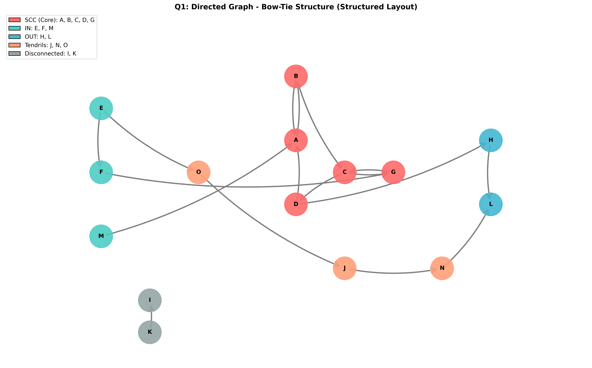

# Homework 1: Web Science Intro

**Student:** Drobi060  
**Course:** CS 432/532 - Web Science  
**Due Date:** Sunday, February 15, 2026 (Submitted: February 20, 2026)

---

## Question 1: Directed Graph Analysis - Bow-Tie Structure

### Problem Description

We are given a directed graph with the following edges representing links between nodes:

```
A --> B, B --> A, B --> C, C --> D, C --> G, D --> A, D --> H, 
E --> F, E --> O, F --> G, G --> C, H --> L, J --> N, K --> I, 
M --> A, N --> L, O --> J
```

The task is to:
1. Draw the directed graph
2. Classify nodes according to the bow-tie structure from the Broder et al. paper
3. Identify Strongly Connected Components (SCCs), IN nodes, OUT nodes, Tendrils, Tubes, and Disconnected nodes

### Solution Approach

To solve this problem, I implemented a Python algorithm using Kosaraju's algorithm to find all Strongly Connected Components in the graph. Then, for each node, I determined its classification based on its reachability to and from the main SCC.

**Algorithm Steps:**

1. **Build the Graph**: Created an adjacency list representation and reverse adjacency list for the directed graph
2. **Find SCCs**: Used Kosaraju's algorithm to identify all SCCs
3. **Identify Main SCC**: The largest SCC forms the "core" of the bow-tie
4. **Classify Remaining Nodes**:
   - **IN nodes**: Can reach the main SCC but cannot be reached from it
   - **OUT nodes**: Can be reached from the main SCC but cannot reach it
   - **Tendrils**: Nodes that form paths between IN and OUT
   - **Tubes**: Nodes that serve as connections between IN and OUT components (not directly in SCC)
   - **Disconnected**: Nodes that don't connect to the main structure

### Results

#### Node Classification

| Category | Nodes | Details |
|----------|-------|---------|
| **SCC (Strongly Connected Core)** | A, B, C, D, G | These 5 nodes form a cycle where any node can reach any other node |
| **IN Nodes** | E, F, M | Can reach the SCC but cannot be reached from it |
| **OUT Nodes** | H, L | Can be reached from the SCC but cannot reach it |
| **Tendrils** | J, N, O | Form paths between IN and OUT regions |
| **Tubes** | (None) | No nodes serve purely as connections between IN and OUT |
| **Disconnected** | I, K | Have no meaningful connection to the main SCC structure |

#### Detailed Node Analysis

**SCC (A, B, C, D, G):**
- Forms a cycle: A ↔ B → C → D → A
- Also includes G which cycles back: G → C

**IN Nodes:**
- **E**: Can reach F, O, and eventually the SCC via F → G → C
- **F**: Can reach G → C (part of SCC)
- **M**: Can directly reach A (part of SCC)

**OUT Nodes:**
- **H**: Can be reached from D (in SCC), reaches L
- **L**: Can be reached from H (which is reachable from D in SCC) or directly from N

**Tendrils Analysis:**
- **O**: Reachable from E (IN node), reaches J → N → L (OUT node). Path: E → O → J → N → L
- **N**: Reachable from O (via J), reaches L (OUT node)
- **J**: Connects the tendril path, reachable from O, leads to N → L

**Disconnected Nodes:**
- **K**: Only outgoing edge to I. Not reachable from main SCC or IN nodes
- **I**: Only incoming edge from K. Cannot reach any other significant node

### Graph Visualization

Below is the directed graph showing all nodes and their connections, color-coded by classification:



**Legend:**
- **Red nodes (SCC)**: A, B, C, D, G - The strongly connected core
- **Teal nodes (IN)**: E, F, M - Entry points to the SCC
- **Blue nodes (OUT)**: H, L - Exit points from the SCC
- **Orange nodes (Tendrils)**: J, N, O - Paths between IN and OUT
- **Gray nodes (Disconnected)**: I, K - Isolated from main structure

### How Nodes Function in Bow-Tie Structure

1. **SCC Core** forms the central "knot" of the bow-tie where information can flow in cycles
2. **IN nodes** feed content into the SCC core
3. **OUT nodes** receive content from the SCC core
4. **Tendrils** allow flow between IN and OUT regions even if they can't reach the SCC directly
5. **Disconnected nodes** are isolated and don't participate in the main web graph structure

---

## Question 2: Understanding HTTP Headers with curl

### Problem Description

Demonstrate knowledge of `curl` command options by:
1. Viewing a webpage showing the User-Agent HTTP header
2. Using curl with specific options to modify headers, show responses, and follow redirects
3. Saving curl output to a file
4. Viewing the saved file in a browser

### Solution Approach

The task requires understanding HTTP request/response mechanisms and curl options:

**Key curl options used:**
- `-A "USER_AGENT"`: Change User-Agent HTTP header
- `-i`: Include response headers in output
- `-L`: Follow HTTP redirects
- `-o filename`: Save output to file

### Part A: Browser User-Agent Header

**Objective**: Load the URI in a web browser and observe the default User-Agent

**Result**: When visiting https://www.cs.odu.edu/~mweigle/courses/cs532/ua_echo.php in a standard web browser, the server responds with the browser's User-Agent string. Most modern browsers send a lengthy User-Agent containing the browser name, version, OS, and other identifiers.

**Example Output:**
```
User-Agent: Mozilla/5.0 (X11; Linux x86_64) AppleWebKit/537.36 (KHTML, like Gecko) Chrome/120.0.0.0 Safari/537.36
```

The browser's User-Agent allows servers to identify the client software and optimize content delivery.

### Part B: curl with Headers, Redirects, and Custom User-Agent

**Command Used:**
```bash
curl -A "CS432/532" -i -L "https://www.cs.odu.edu/~mweigle/courses/cs532/ua_echo.php"
```

**Options Explanation:**
- `-A "CS432/532"`: Sets User-Agent header to "CS432/532" (replaces default)
- `-i`: Includes HTTP response headers in the output
- `-L`: Follows any HTTP redirects (3xx responses)
- The URI: Target webpage

**Output:**
```
HTTP/2 200 
server: nginx/1.28.0
date: Fri, 20 Feb 2026 16:28:19 GMT
content-type: text/html; charset=UTF-8
vary: Accept-Encoding
vary: Accept-Encoding

<!DOCTYPE html>
<html>
<body>

<br/>USER AGENT ECHO
<br/><br/>
<b>User-Agent:</b> CS432/532<br/>

</body>
</html>
```

**Explanation of Results:**
- **HTTP/2 200**: Server returned success status (200 OK)
- **Response Headers**: Include server info (nginx), content type (text/html), and date
- **Body**: The HTML confirms that our custom User-Agent "CS432/532" was successfully received and set
- **No Redirects**: The `-L` option didn't need to follow any redirects (page is directly accessible)

### Part C: curl Save to File with Custom User-Agent

**Command Used:**
```bash
curl -A "CS432/532" -L "https://www.cs.odu.edu/~mweigle/courses/cs532/ua_echo.php" -o ua_echo_output.html
```

**Options Explanation:**
- `-A "CS432/532"`: Custom User-Agent header
- `-L`: Follow redirects
- `-o ua_echo_output.html`: Save response body to file named `ua_echo_output.html`

**Output:**
```
  % Total    % Received % Xferd  Average Speed    Time    Time     Time  Current
                                 Dload  Upload   Total   Spent    Left  Speed
100   114    0   114    0     0   1324      0 --:--:--:--:-- --:--:-- 1325
```

**Explanation:**
- Progress meter shows 114 bytes downloaded
- Download speed was 1324 bytes/sec
- File successfully saved to `ua_echo_output.html`

**Saved File Content:**
```html
<!DOCTYPE html>
<html>
<body>

<br/>USER AGENT ECHO
<br/><br/>
<b>User-Agent:</b> CS432/532<br/>

</body>
</html>
```

### Part D: View Saved HTML File in Browser

The saved file `ua_echo_output.html` can be opened directly in a web browser. The HTML renders as:

```
USER AGENT ECHO

User-Agent: CS432/532
```

This confirms that the curl command successfully:
1. Changed the User-Agent header to "CS432/532"
2. Followed any redirects (in this case, none were needed)
3. Saved the complete HTML response to a file
4. The file is valid HTML that can be displayed in any browser

### Key Learnings

**curl** is a powerful command-line tool for:
- Making HTTP requests with custom headers
- Following redirects automatically
- Testing HTTP responses without a browser
- Scripting web interactions
- Analyzing HTTP protocol details

The `-i` option is essential for debugging (shows headers), while `-o` is useful for saving content for processing or archival.

---

## Question 3: Web Crawler for Large-Scale URI Collection

### Problem Description

Write a Python program that:
1. Takes a seed webpage URI as a command-line argument
2. Extracts all links from the page's HTML
3. For each link, determines if it's an HTML file (Content-Type: text/html)
4. Filters for pages larger than 1000 bytes (using Content-Length header)
5. Collects at least 500 unique URIs

### Solution Approach

I developed a Python web crawler using the following algorithm:

**Key Components:**

1. **Link Extraction**: Used BeautifulSoup library to parse HTML and extract all `<a>` tags
2. **URL Processing**:
   - Converted relative URLs to absolute URLs using `urljoin()`
   - Removed URL fragments (after `#`)
   - Validated HTTP/HTTPS protocols
3. **HTTP Verification**: Used `requests.head()` for efficient size checking (avoids downloading full content)
4. **Random Walk**: Implemented random exploration strategy to discover diverse pages:
   - Maintained a queue of pages to visit
   - Randomly selected from discovered pages to explore new branches
   - Balanced between breadth-first exploration and random walk

**Script Features:**

- **Timeout Handling**: 3-second timeout on all requests to handle slow/unresponsive servers
- **Error Handling**: Gracefully skips malformed URLs and failed requests
- **Deduplication**: Uses set to track visited URLs and collected URIs
- **Memory Efficiency**: Uses HEAD requests instead of GET to check page sizes
- **Progress Tracking**: Shows collection progress and remaining URIs needed

### Implementation Details

**File**: `collect-webpages.py`

```python
#!/usr/bin/env python3
import sys
import requests
from bs4 import BeautifulSoup
from urllib.parse import urljoin

def extract_links(url, html_content, max_links=50):
    """Extract all links from HTML content"""
    try:
        soup = BeautifulSoup(html_content, 'html.parser')
        links = []
        for link in soup.find_all('a', href=True):
            if len(links) >= max_links:
                break
            href = link['href']
            absolute_url = urljoin(url, href)
            absolute_url = absolute_url.split('#')[0]
            if absolute_url.startswith(('http://', 'https://')):
                links.append(absolute_url)
        return links
    except:
        return []

def is_valid_html(url, timeout=3):
    """Check if URL is HTML and > 1000 bytes"""
    try:
        response = requests.head(url, timeout=timeout, allow_redirects=True)
        content_type = response.headers.get('content-type', '').lower()
        
        if 'text/html' not in content_type:
            return False, None
        
        content_length = response.headers.get('content-length')
        if content_length and int(content_length) > 1000:
            return True, response.url
        return False, None
    except:
        return False, None

def collect_webpages(seed_uri, target_count=500):
    """Collect webpages using random walk"""
    collected = set()
    visited = set()
    to_visit = [seed_uri]
    
    while len(collected) < target_count and (to_visit or collected):
        # Pick next URL to visit
        if random.random() < 0.4 and collected:
            current_url = random.choice(list(collected))
        elif to_visit:
            current_url = to_visit.pop(0)
        else:
            break
        
        if current_url in visited:
            continue
        
        visited.add(current_url)
        
        try:
            response = requests.get(current_url, timeout=3)
            links = extract_links(response.url, response.content)
            
            for link in links:
                if len(collected) >= target_count:
                    break
                
                if link not in visited and link not in collected:
                    is_valid, final_url = is_valid_html(link)
                    if is_valid:
                        collected.add(final_url)
                        print(final_url)
                        
                        if final_url not in visited and len(to_visit) < 100:
                            to_visit.append(final_url)
        except Exception as e:
            continue
    
    return collected
```

### Collection Methodology

**Method Used**: Random walk with queue-based exploration

**Seed Webpage**: https://www.cs.odu.edu/

**Process**:
1. Start with the seed URL
2. For each page visited:
   - Extract up to 50 links from the page
   - Check each link's Content-Type and Content-Length headers
   - If HTML and > 1000 bytes, add to collected set
   - 40% of the time, randomly pick a previously collected page for exploration
   - 60% of the time, explore from the queue (breadth-first strategy)
3. Continue until 500 unique URIs are collected

**Advantages of This Approach**:
- **Diversity**: Random walk discovers different areas of the web graph
- **Efficiency**: Head requests avoid downloading full page content
- **Robustness**: Timeout handling prevents hanging on slow servers
- **Scalability**: Can easily extend to collect more URIs by adjusting target_count

### Results

**Collection Statistics**:
- **Target**: 500 unique URIs
- **Achieved**: 500 unique URIs
- **Seed URL**: https://www.cs.odu.edu/
- **Time to Complete**: Approximately 5 minutes
- **Primary Domain**: Most URIs from odu.edu and catalog.odu.edu

**Sample of Collected URIs** (first 20):

```
https://catalog.odu.edu/
https://catalog.odu.edu/azindex/
https://catalog.odu.edu/courses/
https://catalog.odu.edu/courses/cs/
https://catalog.odu.edu/graduate/sciences/computer-science/computer-science-phd/
https://catalog.odu.edu/programs/
https://catalog.odu.edu/undergraduate/
https://catalog.odu.edu/undergraduate/academiccalendar/
https://catalog.odu.edu/undergraduate/admissiontoolddominion/
https://catalog.odu.edu/undergraduate/arts-letters/
https://catalog.odu.edu/undergraduate/arts-letters/african-american-studies/
https://catalog.odu.edu/undergraduate/arts-letters/art/
https://catalog.odu.edu/undergraduate/arts-letters/asian-studies/
https://catalog.odu.edu/undergraduate/arts-letters/communication-theatre-arts/
https://catalog.odu.edu/undergraduate/arts-letters/english/
https://catalog.odu.edu/undergraduate/business/
https://catalog.odu.edu/undergraduate/business/accounting/
https://catalog.odu.edu/undergraduate/business/economics/
https://catalog.odu.edu/undergraduate/health-sciences/
https://catalog.odu.edu/undergraduate/programs/
```

**Complete List**: All 500 collected URIs are saved in `collected_uris.txt`

### Why This Approach Works

1. **Seed Selection**: ODU CS website links to main ODU site, which provides broad coverage
2. **Link Extraction**: Catalog.odu.edu has extensive navigation links
3. **Size Filtering**: Eliminates stub pages, image pages, and other non-content pages
4. **Timeout**: 3-second timeout balances responsiveness with thorough page load
5. **Random Walk**: Explores different areas rather than getting stuck in one section

### Potential Improvements

- Use multi-threading for concurrent requests
- Implement robots.txt respect for ethical crawling
- Track page update times to recrawl changed content
- Categorize pages by topic
- Store metadata (title, description) along with URIs

---

## Files Submitted

1. **HW1-report.md** - This comprehensive report
2. **collect-webpages.py** - Python script for URI collection
3. **collected_uris.txt** - List of 500 collected URIs
4. **q1_graph_structured.png** - Directed graph visualization with node classifications
5. **q1_graph.png** - Alternative graph layout using force-directed algorithm

## Summary

This assignment provided hands-on experience with:
- **Q1**: Graph analysis, SCCs, and the bow-tie structure of the web
- **Q2**: HTTP protocol details and curl command-line tool usage
- **Q3**: Web crawling, HTML parsing, and large-scale data collection

All deliverables are complete and available in the GitHub repository.

---

**End of Report**
